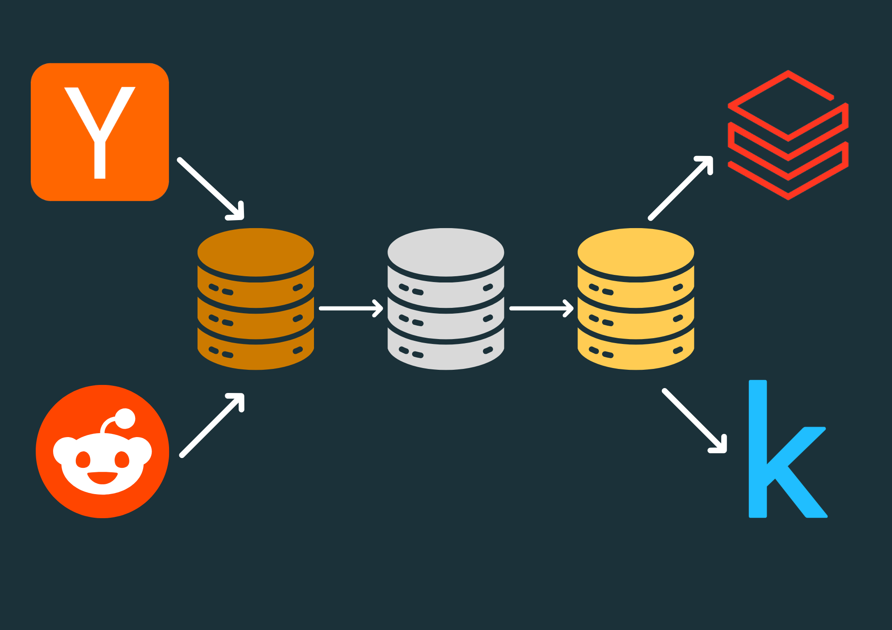
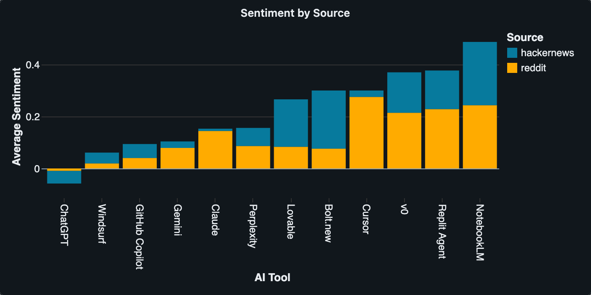
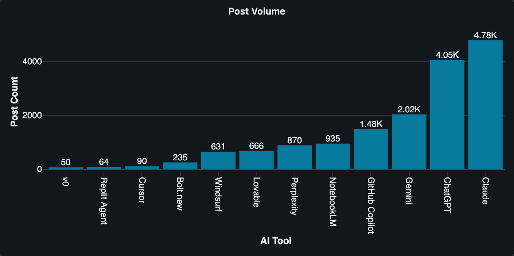
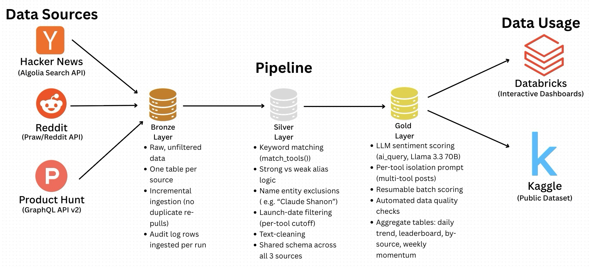
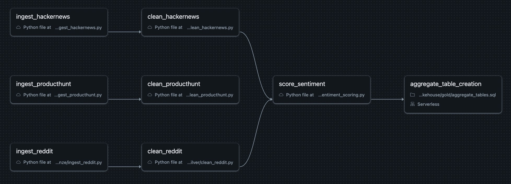
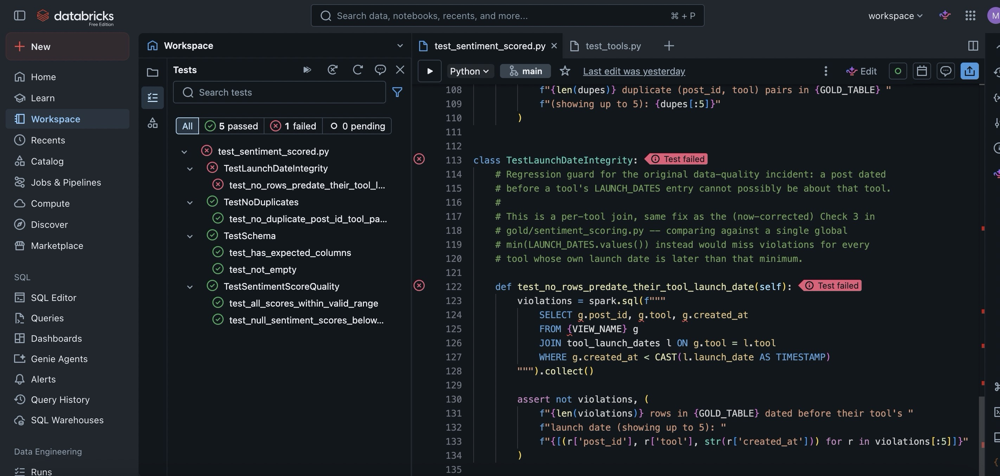

# AI Tool Sentiment Lakehouse

<p align="center">
  
</p>

<p align="center">
  <em>A daily-automated data pipeline tracking public sentiment toward 12 AI coding & chat tools, built on Databricks.</em>
</p>

<p align="center">
  <a href="https://www.kaggle.com/datasets/matthewcendana/ai-coding-and-chat-tool-sentiment/data"> Kaggle Dataset</a> ·
  <a href="https://dbc-f6a5d699-f720.cloud.databricks.com/dashboardsv3/01f18556b1531539a40e57af2c51084f/published?o=7474657265588430"> Live Dashboard on Databricks</a> ·
  <a href="#replication-guide"> Replicate This</a>
</p>

---

## What This Project Does

This project collects public discussions about 12 leading AI coding and chat tools from Reddit and Hacker News, uses an LLM to score sentiment toward each tool, and serves the results through an automated, daily-refreshed data pipeline on Databricks — with outputs published as a public Kaggle dataset and an interactive dashboard.

**Tools tracked:** ChatGPT, Claude, Gemini, Perplexity, Cursor, GitHub Copilot, Windsurf, NotebookLM, Lovable, Bolt.new, v0, and Replit Agent.

**Data sources:** Reddit (via the Reddit API) and Hacker News (via the Algolia Search API). A third source, Product Hunt, was evaluated and ultimately excluded from sentiment scoring — see [Known Limitations](#known-limitations) for why.

### Key Results

- Cursor had the highest average sentiment across reddit posts. NotebookLM had the highest average sentiment score across Hacker News and both platforms combined.

<p align="center">
  
</p>

- Claude had the highest discussion volume with over 4,700 posts.
<p align="center">
  
</p>

---

## Architecture

<p align="center">
  
</p>

The pipeline follows a **medallion (bronze/silver/gold) architecture** on Databricks:

| Layer | Purpose |
|---|---|
| **Bronze** | Raw, unfiltered data landed directly from each source's API. One table per source, incrementally ingested (no duplicate re-pulls on scheduled reruns). |
| **Silver** | Cleaned and filtered data — keyword-matched to the 12 tracked tools, deduplicated, normalized to a shared schema across sources. |
| **Gold** | LLM-scored sentiment per post, plus pre-aggregated summary tables (daily trend, tool leaderboard, source comparison, weekly momentum) — all built in SQL. |

The whole pipeline runs as a scheduled **Databricks Workflow (Job)**: three parallel bronze→silver branches (one per source) converge into a gold sentiment-scoring task, followed by an aggregate-table rebuild task.

<p align="center">
  
</p>

---

## The Data Quality Journey

Getting from "scrape some posts" to "trustworthy sentiment numbers" took several rounds of debugging. This section documents that process, since it's the most substantive engineering work I did in this project.

### Problem 1: Posts predating the tools themselves

Early exploration turned up posts dated **2010–2020** — years before any of these AI tools existed — tagged as being "about" them. Something in the matching logic was wrong.

### Root cause: several tool names are ordinary English words or names

The keyword matcher was flagging any text containing a tool's name, with no regard for context:

- **"Claude"** — a common first name (the biggest offender turned out to be historical articles about *Claude Shannon*, the father of information theory)
- **"Lovable"** — a common adjective ("what a lovable dog")
- **"Windsurf"** — the actual sport, discussed on Hacker News long before the AI tool existed
- **"Gemini"** — NASA's Gemini space program, the zodiac sign
- **"Perplexity"** — a common word meaning confusion

### Fix attempt 1: strong vs. weak alias matching

Aliases were split into two tiers:
- **Strong aliases** (e.g. `"claude.ai"`, `"windsurf.dev"`) are unambiguous and match on their own.
- **Weak aliases** (bare `"claude"`, `"windsurf"`, `"lovable"`, etc.) only count as a match if the surrounding text *also* contains an AI/tech context keyword (e.g. "chatbot," "coding assistant," "openai").

This caught most false positives — but not all.

### Fix attempt 2: explicit exclusion phrases
 
Articles about **Claude Shannon** slipped through the context filter, because articles about information theory and computing naturally contain tech-context words like "machine" or "computing" — exactly the kind of words the context filter was designed to accept. An explicit exclusion list (`"claude shannon"`, `"claude monet"`, etc.) was added, checked *before* any other matching logic, to block these regardless of context.

### Final fix: launch-date filtering

The most robust fix turned out to be the simplest: **a post cannot be about a tool that didn't exist yet.** A `LAUNCH_DATES` reference table was added, mapping each tool to its actual public release date. Any silver-layer row dated before its matched tool's launch date is dropped automatically — regardless of what specific word or phrase triggered the match. This single rule subsumes every keyword-based edge case above.

### A separate class of bug: LLM sentiment misattribution

Once matching was clean, a second issue emerged in the sentiment-scoring step: posts that **compared or "roasted" multiple tools at once** were sometimes scored incorrectly. One clear example — a lighthearted "roasting every AI tool" post included the line *"Lovable — the reason why AI cannot replace devs,"* which is a backhanded criticism of Lovable specifically, but the LLM scored it `1.0` (maximally positive), apparently reacting to the post's overall jokey tone rather than the tool-specific sentiment.

**Fix:** the scoring prompt was rewritten to explicitly instruct the model to isolate sentiment to the *specific* tool being scored, ignore sentiment toward other tools mentioned in the same text, and watch for sarcasm/backhanded phrasing. A related issue — sentiment scores clustering at exactly `-1`, `0`, or `1` with no gradient — was addressed by explicitly prompting for decimal precision (e.g. `0.3`, `-0.6`) rather than only extreme values.

### Regression testing

To make sure these specific bugs can't silently reappear, two pytest suites were built:
- **`tests/test_tools.py`** — unit tests for the keyword-matching logic, including direct regression cases for the Claude Shannon exclusion and the "model"/Gemini false positive.
- **`tests/test_sentiment_scored.py`** — runs against the live gold table on a Databricks cluster, checking for out-of-range scores, excessive nulls, duplicate rows, and any row that predates its tool's launch date.

<p align="center">
  
</p>
*Example of test view on Databricks and failed test

---

## Automation & Orchestration

The full pipeline runs unattended as a **Databricks Workflow**, scheduled daily:

- **Incremental ingestion** — each bronze script tracks the latest timestamp already ingested and only pulls newer data, avoiding duplicate re-pulls and wasted API quota on every scheduled run.
- **Incremental cleaning** — silver scripts use a watermark on `ingested_at` to only process bronze rows added since the last run, rather than re-cleaning the entire table every time.
- **Resumable sentiment scoring** — `ai_query()` calls are batched (500 rows at a time) and loop automatically until everything is scored or a runtime safety cap is hit; fully resumable if interrupted (e.g. by hitting a compute quota).
- **Automated data quality checks** — after every scoring run, the pipeline checks for out-of-range sentiment scores, excessive null rates, and launch-date violations, logging results for monitoring.
- **Audit logging** — every task in every run (bronze, silver, gold, and DQ checks) writes a row to a shared `pipeline_audit_log` Delta table: timestamp, rows processed, status, and error message if failed. This gives a queryable history of the pipeline's health over time, rather than relying on manually clicking through job run logs.

---

## Tech Stack

| Category | Tools |
|---|---|
| **Platform** | Databricks (Unity Catalog, Delta Lake, Workflows, AI/BI Dashboards, Serverless Compute) |
| **Languages** | PySpark, SQL, Python |
| **Data Sources** | Reddit API (PRAW), Hacker News (Algolia Search API), Product Hunt (GraphQL API v2) |
| **Sentiment Model** | Meta Llama 3.3 70B, via Databricks `ai_query()` |
| **Testing** | pytest |
| **Outputs** | Kaggle, Databricks AI/BI Dashboard |

---

## Known Limitations

- **Sentiment scores are LLM-generated, not human-labeled.** They reflect one model's interpretation of tone and should be read as a directional signal, not ground truth.
- **Self-promotional posts may skew positive.** A post announcing "I built X with [tool]" is inherently upbeat about the poster's own creation, which can inflate a tool's apparent sentiment relative to posts reflecting neutral or critical third-party experience.
- **Product Hunt was excluded from sentiment scoring.** Its content turned out to be overwhelmingly product-launch descriptions and third-party integrations (a separate product built *using* an AI tool as a backend feature), rather than opinions *about* the tracked tools themselves. Bronze and silver ingestion for Product Hunt still run as a documented, standalone branch, but it doesn't feed into the gold sentiment tables.
- **The keyword-matching system isn't exhaustive.** The launch-date filter catches the large majority of false positives, but no exclusion-phrase list can anticipate every possible generic-word collision. This gap is documented directly in the test suite via an intentionally failing (`xfail`) test case, rather than claimed as fully solved.

---

## Replication Guide

<details>
<summary>Click to expand setup instructions</summary>

### Prerequisites
- A Databricks workspace with Unity Catalog enabled
- A Reddit API app ([reddit.com/prefs/apps](https://www.reddit.com/prefs/apps)) — client ID, client secret
- A Product Hunt developer token ([api.producthunt.com/v2/oauth/applications](https://api.producthunt.com/v2/oauth/applications)) — optional, only needed if replicating the Product Hunt branch

### 1. Unity Catalog setup
Create a catalog with three schemas:
```sql
CREATE CATALOG IF NOT EXISTS ai_tool_sentiment;
CREATE SCHEMA IF NOT EXISTS ai_tool_sentiment.bronze;
CREATE SCHEMA IF NOT EXISTS ai_tool_sentiment.silver;
CREATE SCHEMA IF NOT EXISTS ai_tool_sentiment.gold;
```

### 2. Store API credentials in Databricks Secrets
```bash
databricks secrets create-scope reddit
databricks secrets put-secret reddit client_id
databricks secrets put-secret reddit client_secret
databricks secrets put-secret reddit user_agent

databricks secrets create-scope producthunt
databricks secrets put-secret producthunt api_token
```

### 3. Clone this repo into Databricks Repos
Sync this GitHub repo as a Databricks Repo so the notebooks and shared modules (`config/`, `utils/`) are available on the same relative paths the scripts expect.

### 4. Environment / dependency notes
- Most scripts use only what ships with the Databricks Runtime (`requests`, `pyspark`).
- `bronze/ingest_reddit.py` requires `praw`, which is **not** in the default runtime. On serverless compute, notebook-scoped `%pip install` can behave inconsistently — the reliable fix is adding `praw` as an explicit dependency in that task's environment configuration (Databricks' serverless environment editor), not just a `%pip install` cell.
- UDFs that import shared local modules (`config/tools.py`, `utils/schema.py`) need `spark.addArtifact(path, pyfile=True)` on serverless compute — the older `sparkContext.addPyFile()` API is not supported under Spark Connect/serverless.

### 5. Run order
1. Run each `bronze/ingest_*.py` notebook once to seed initial data.
2. Run each `silver/clean_*.py` notebook.
3. Run `gold/sentiment_scoring.py` (re-run as needed if it hits the time safety cap — it's fully resumable).
4. Run `gold/aggregate_tables.sql`.

### 6. Automate it
Set up a Databricks Workflow (Job) chaining the above as tasks with dependencies, and add a daily schedule trigger. See the [Architecture](#architecture) section for the DAG structure.

### 7. Run the tests
```bash
pytest tests/test_tools.py -v
```
`tests/test_sentiment_scored.py` requires a live Databricks cluster with Unity Catalog access — run it from the Databricks workspace file editor's Tests pane, not locally.

</details>

---

## Repository Structure

```
ai-sentiment-lakehouse/
├── config/
│   └── tools.py              # Tool aliases, exclusion phrases, launch dates
├── utils/
│   ├── schema.py              # Shared silver-layer schema
│   └── audit_log.py           # Pipeline run logging helper
├── bronze/
│   ├── ingest_hackernews.py
│   ├── ingest_reddit.py
│   └── ingest_producthunt.py
├── silver/
│   ├── clean_hackernews.py
│   ├── clean_reddit.py
│   └── clean_producthunt.py
├── gold/
│   ├── sentiment_scoring.py
│   └── aggregate_tables.sql
├── tests/
│   ├── test_tools.py
│   └── test_sentiment_scored.py
├── docs/
│   └── images/                # screenshots 
└── requirements.txt
```

---

## License
This project's code is licensed under Apache-2.0. The published dataset is licensed under CC BY-NC 4.0 — see the [Kaggle dataset page](https://www.kaggle.com/datasets/matthewcendana/ai-coding-and-chat-tool-sentiment/data) for details. Note: this license applies to the compiled dataset and derived sentiment scores; original post content belongs to its respective authors and source platforms (Reddit, Hacker News).